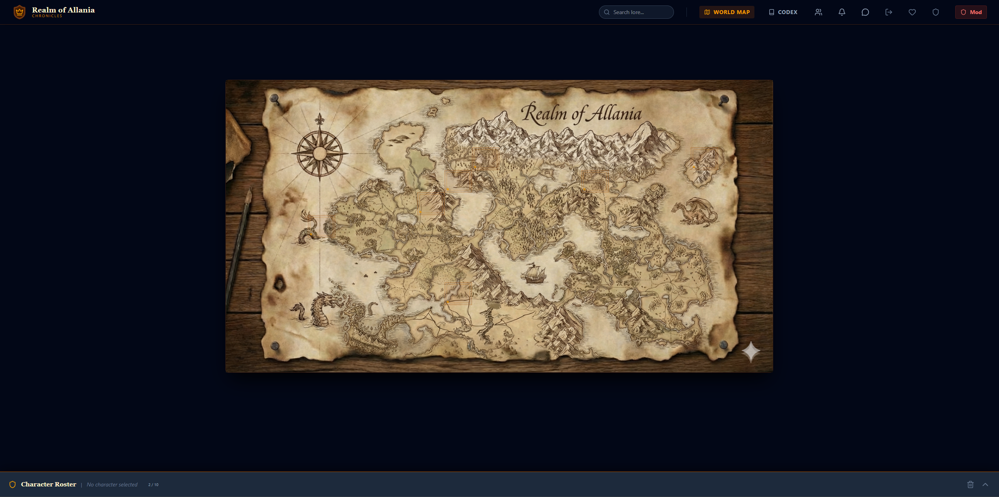
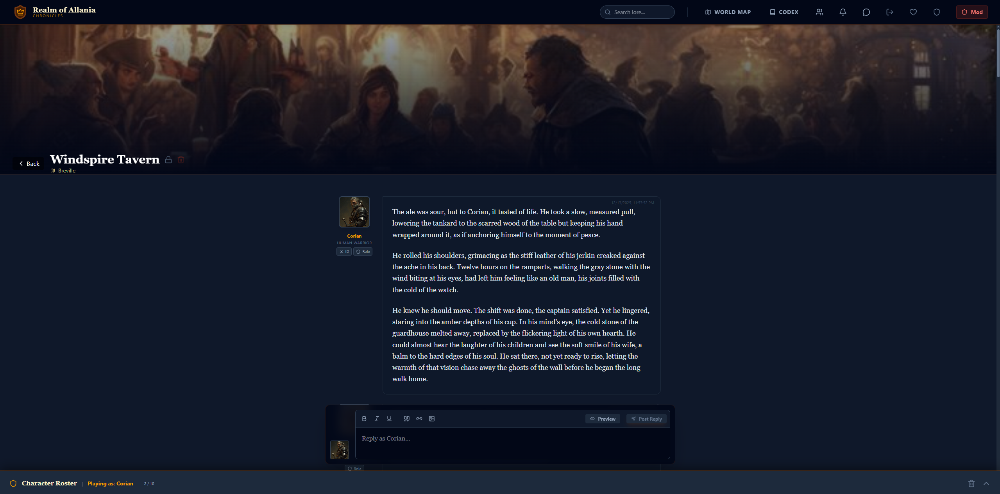

<div align="center">

# 👑 Realm of Allania

**A modern, immersive Play-by-Post (PbP) roleplaying platform built with Next.js and Firebase.**


<p align="center">
  <a href="#-key-features">Key Features</a> •
  <a href="#-tech-stack">Tech Stack</a> •
  <a href="#-getting-started">Getting Started</a> •
  <a href="#-contributing">Contributing</a>
</p>

</div>

---

**Realm of Allania** is a web-based RPG application designed to modernize the classic forum roleplaying experience. It combines the depth of text-based storytelling with modern interactive tools like a dynamic world map, integrated character sheets, real-time read receipts, and a rich media codex.

## 📸 Screenshots




## ✨ Key Features

| Feature | Description |
| :--- | :--- |
| **🗺️ Interactive World Map** | Navigate the world of Allania by visually selecting regions. See where the action is happening with live activity indicators. |
| **📝 Play-by-Post Forum** | A robust threading system designed for roleplay. Write as your character, complete with avatar integration and rich text formatting. |
| **🛡️ Character Roster** | Create and manage multiple character identities. Seamlessly switch between them when posting to maintain immersion. |
| **📖 The Codex** | An integrated wiki system for storing lore, history, and character backstories. Features a built-in gallery manager for uploading artwork. |
| **⚡ Real-Time Interactions** | Powered by Firestore for instant updates, read receipts, and live thread activity. |
| **🎲 Role-Based Permissions** | Granular control for Admins and Moderators to manage users and maintain order directly from the forum interface. |
| **🚀 Optimizations** | High-performance components with memoization, virtualized lists for chat, and optimized Firestore queries for scalability. |

## 🛠️ Tech Stack

-   **Frontend**: Next.js 16 (React 19), Tailwind CSS 4
-   **Backend**: Google Firebase 12 (Firestore, Authentication, Storage, App Check)
-   **Icons**: Lucide React
-   **Deployment**: Vercel

## 🚀 Getting Started

Follow these steps to set up the Realm locally on your machine.

### Prerequisites

-   **Node.js** (v18 or higher)
-   **npm** or **yarn**
-   **Firebase Project** (Free Tier is sufficient)

### Installation

1.  **Clone the repository**
    ```bash
    git clone https://github.com/your-username/realm-of-allania.git
    cd realm-of-allania
    ```

2.  **Install Dependencies**
    ```bash
    npm install
    ```

3.  **Environment Setup**
    Create a `.env.local` file in the root directory. You will need your Firebase configuration keys here:

    ```env
    NEXT_PUBLIC_FIREBASE_API_KEY=your_api_key
    NEXT_PUBLIC_FIREBASE_AUTH_DOMAIN=your_project_id.firebaseapp.com
    NEXT_PUBLIC_FIREBASE_PROJECT_ID=your_project_id
    NEXT_PUBLIC_FIREBASE_STORAGE_BUCKET=your_project_id.firebasestorage.app
    NEXT_PUBLIC_FIREBASE_MESSAGING_SENDER_ID=your_sender_id
    NEXT_PUBLIC_FIREBASE_APP_ID=your_app_id
    # Optional: For App Check
    NEXT_PUBLIC_RECAPTCHA_SITE_KEY=optional_recaptcha_key
    ```

4.  **Run the Development Server**
    ```bash
    npm run dev
    ```

5.  **Open the Realm**
    Visit [http://localhost:3000](http://localhost:3000) in your browser.

## 🧪 Testing

We use **Jest** and **React Testing Library** for frontend testing, and the **Firebase Emulator Suite** for backend testing.

### Frontend Tests

To run the frontend test suite:

```bash
npm test
```

To run tests in watch mode:

```bash
npm run test:watch
```

### Backend Tests

To run Cloud Functions tests:

```bash
cd functions
npm test
```

## 📂 Project Structure

```text
src/
├── app/          # Main Next.js App Router pages and layouts
├── components/   # UI components
│   ├── Chat/     # Chat system components
│   ├── Codex/    # Wiki and Lore components
│   ├── Forum/    # Thread and Post components
│   ├── Legal/    # TOS and Privacy Policy
│   └── ...       # Shared components (Map, Character Drawer, etc.)
├── context/      # React Context providers (GameContext)
├── hooks/        # Custom React hooks
├── lib/          # Utility functions and Firebase initialization
├── middleware.js # Next.js middleware
functions/        # Firebase Cloud Functions
public/           # Static assets (Map images, icons)
```

## 🔒 Permissions & Roles

The application uses a secure, database-driven role system.

-   **User**: Standard access. Can create characters and post in threads.
-   **Moderator**: Can delete posts and threads.
-   **Admin**: Full access, including the ability to change user roles via the UI.

## 🤝 Contributing

Contributions are welcome! Please feel free to submit a Pull Request.

1.  Fork the Project
2.  Create your Feature Branch (`git checkout -b feature/AmazingFeature`)
3.  Commit your Changes (`git commit -m 'Add some AmazingFeature'`)
4.  Push to the Branch (`git push origin feature/AmazingFeature`)
5.  Open a Pull Request

## 📄 License

This project is licensed under the MIT License.
