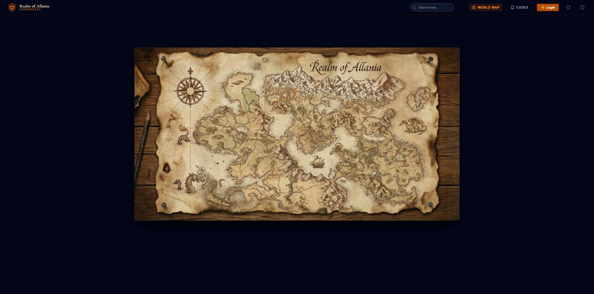
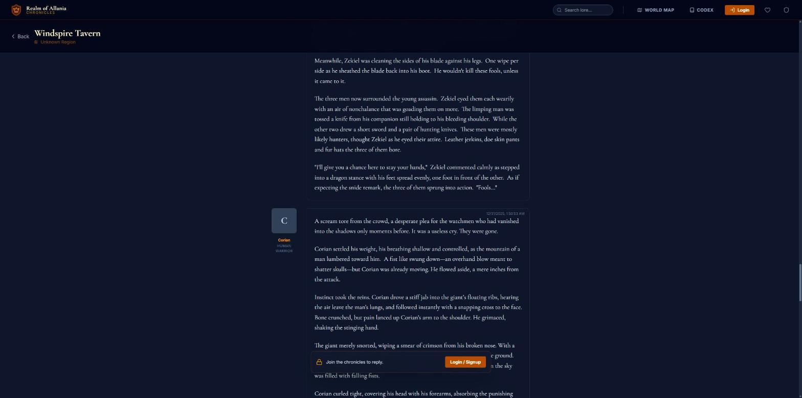

<div align="center">

# 👑 Realm of Allania

**A modern, immersive Play-by-Post (PbP) roleplaying platform built with Next.js and Firebase.**


<p align="center">
  <a href="#-key-features">Key Features</a> •
  <a href="#-tech-stack">Tech Stack</a> •
  <a href="#-getting-started">Getting Started</a> •
  <a href="#-deployment">Deployment</a> •
  <a href="#-contributing">Contributing</a>
</p>

</div>

---

**Realm of Allania** is a web-based RPG application designed to modernize the classic forum roleplaying experience. It combines the depth of text-based storytelling with modern interactive tools like a dynamic world map, integrated character sheets, real-time read receipts, and a rich media codex.

## 📸 Screenshots




## ✨ Key Features

| Feature | Description |
| :--- | :--- |
| **🗺️ Interactive World Map** | Navigate the world of Allania by visually selecting regions. See where the action is happening with live activity indicators. |
| **📝 Play-by-Post Forum** | A threading system designed for roleplay. Write as your character, with portraits, rich text formatting and `[[wiki links]]` to the Codex. |
| **🛡️ Character Roster** | Create and manage up to 10 characters and switch between them when posting. Renaming or deleting a character updates every post written as it. |
| **📖 The Codex** | A shared wiki for lore, history and character backstories, with a gallery for artwork. Moderators can lock pages as "Sacred Texts". |
| **💬 Private Messages** | Character-to-character chat, shown under each character's real name. |
| **⚡ Real-Time Interactions** | Powered by Firestore for instant updates, read receipts, live thread activity and an "Active Users" list. |
| **🧹 Content Moderation** | New posts, threads, codex edits and images are checked by an AI moderator (with a keyword filter) before they go public. Chat, character profiles and display names use fast word filters. Moderators review anything flagged from a dashboard. |
| **🌗 Dark & Light Themes** | A warm-charcoal dark theme and a parchment light theme, switchable from any thread. Follows your system setting until you choose, and remembers your choice across tabs. |
| **🎲 Role-Based Permissions** | Players, trusted players, moderators and admins, managed from the forum interface. |

## 🛠️ Tech Stack

-   **Frontend**: Next.js 16 (React 19), Tailwind CSS 4, Lucide React icons
-   **Backend**: Google Firebase 12 (Firestore, Authentication, Storage, App Check)
-   **Cloud Functions**: Firebase Functions v2 on Node 22: content moderation through OpenRouter (Google Gemini), image import, character sync
-   **Deployment**: Vercel (website) and Firebase (rules, indexes, functions)

## 🚀 Getting Started

Follow these steps to set up the Realm locally on your machine.

### Prerequisites

-   **Node.js** 22 (Next.js 16 needs at least 20.9; Cloud Functions run on 22)
-   **npm**
-   **A Firebase project** with Email/Password sign-in enabled (the free tier is enough for local development)
-   **Java** (only for the Firebase emulator tests)

### Installation

1.  **Clone the repository**
    ```bash
    git clone https://github.com/Talnerith/realm-of-allania.git
    cd realm-of-allania
    ```

2.  **Install dependencies**
    ```bash
    npm install
    cd functions && npm install && cd ..
    ```

3.  **Environment setup**
    Copy `.env.example` to `.env.local` and fill in your Firebase web app config:

    ```env
    NEXT_PUBLIC_FIREBASE_API_KEY=your_api_key
    NEXT_PUBLIC_FIREBASE_AUTH_DOMAIN=your_project_id.firebaseapp.com
    NEXT_PUBLIC_FIREBASE_PROJECT_ID=your_project_id
    NEXT_PUBLIC_FIREBASE_STORAGE_BUCKET=your_project_id.firebasestorage.app
    NEXT_PUBLIC_FIREBASE_MESSAGING_SENDER_ID=your_sender_id
    NEXT_PUBLIC_FIREBASE_APP_ID=your_app_id
    # Optional: App Check (skipped on localhost)
    NEXT_PUBLIC_RECAPTCHA_SITE_KEY=optional_recaptcha_key
    # Optional: shows a "Support" button in the navbar
    NEXT_PUBLIC_KOFI_URL=
    ```

4.  **Run the development server**
    ```bash
    npm run dev
    ```

5.  **Open the Realm**
    Visit [http://localhost:3000](http://localhost:3000). New accounts must verify their email before they can post.

## 🧪 Testing

We use **Jest** and **React Testing Library** for the website, and the **Firebase Emulator Suite** for security rules and moderation.

| What | Command |
| :--- | :--- |
| Website tests | `npm test` (watch mode: `npm run test:watch`) |
| Cloud Functions tests | `cd functions && npm test` |
| Security rules + end-to-end moderation (emulators) | `npx firebase emulators:exec --only firestore,functions "npx jest --config jest.rules.config.js"` |
| Lint | `npm run lint` |

## 📦 Deployment

-   **Website**: pushing to `main` deploys to Vercel automatically.
-   **Firebase**: rules, indexes and functions deploy separately:
    ```bash
    npx firebase deploy --only firestore,storage
    npx firebase deploy --only functions
    ```
-   **Moderation key**: the functions read an OpenRouter API key from a Firebase secret:
    ```bash
    npx firebase functions:secrets:set OPENROUTER_API_KEY
    ```

The site and the rules expect each other's current versions, so deploy both together when a change touches both.

## 🗺️ Updating the World Map

Edit the full-size map art (2816×1504; keep that size so the regions stay aligned), then rebuild the web versions:

```bash
node scripts/optimize-map.js path/to/your-map.png
```

This regenerates `public/map.webp`, the social share image `public/og-image.jpg` and the sign-in background.

## 🎨 Claude Design

The site's components, colors and fonts are synced to a Claude Design design system ("Realm of Allania"), so new screens can be designed with the real components. The sync setup lives in `.design-sync/`. See `.design-sync/NOTES.md` for how it works and how to re-sync after changing components.

## 📂 Project Structure

```text
src/
├── app/            # Next.js App Router: the single-page app shell, moderation dashboard, version API
├── components/     # UI components
│   ├── Chat/       # Chat system components
│   ├── Codex/      # Wiki and lore components
│   ├── Forum/      # Region, thread and post components
│   ├── Legal/      # Terms, privacy and cookie banner
│   └── ...         # Shared components (map, navbar, character drawer, editor, ...)
├── context/        # GameContext: auth, role, characters, read receipts, presence
├── hooks/          # Custom React hooks
├── lib/            # Firebase setup, constants, image and moderation helpers
└── middleware.js   # Security headers and Content Security Policy
functions/          # Firebase Cloud Functions (moderation, image import, character sync)
scripts/            # Maintenance scripts (map optimization, data backfills)
public/             # Static assets (map, icons, landing media)
.design-sync/       # Claude Design sync setup
firestore.rules     # Firestore security rules (the main permission layer)
storage.rules       # Storage security rules
```

## 🔒 Permissions & Roles

The application uses a database-driven role system, enforced by Firestore security rules.

-   **User**: Standard access. Can create characters, post in threads, edit the Codex and chat. Content is moderated before it's public.
-   **Trusted**: Posts skip the AI step (the keyword filter still applies). Granted automatically after 10 approved posts or codex pages across at least 3 threads, on an account at least 14 days old with a verified email.
-   **Moderator**: Can review flagged content, delete posts, threads and images, and lock threads and codex pages.
-   **Admin**: Full access, including changing user roles from the UI.
-   **Banned**: Can read but not post, chat or upload.

Only images uploaded to the site's storage are displayed. Pasted image links are copied into storage and checked like any upload.

## 🤝 Contributing

Contributions are welcome! Please feel free to submit a Pull Request.

1.  Fork the Project
2.  Create your Feature Branch (`git checkout -b feature/AmazingFeature`)
3.  Commit your Changes (`git commit -m 'Add some AmazingFeature'`)
4.  Push to the Branch (`git push origin feature/AmazingFeature`)
5.  Open a Pull Request

## 📄 License

This project is licensed under the MIT License.
